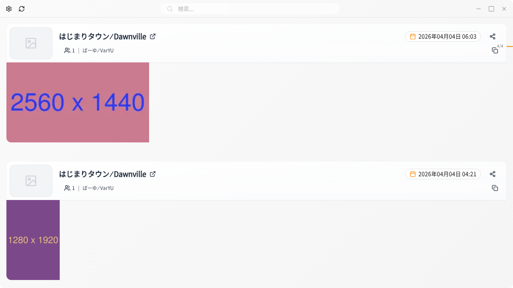

# VRChat Albums

  <a href="./README.md">English</a> |
  <a href="./README.ja.md">日本語</a>

  

  <strong>Organize Your VRChat Memories</strong> 
  A desktop application that automatically organizes your VRChat photos and lets you easily look back on memories with worlds and friends

  
  

## Table of Contents

- [Features](#features)
- [Supported Platforms](#supported-platforms)
- [Installation](#installation)
- [Usage](#usage)
- [FAQ](#faq)
- [Contributing](#contributing)

## Features

### Photo Management
- **Auto Import** - Automatically imports photos from your VRChat photos folder
- **Smart Organization** - Automatically associates photos with VRChat log files and groups them by session
- **Fast Thumbnails** - Optimized thumbnail display for comfortable browsing of large photo collections

### World & Friend Information
- **World Info** - Records when and which world each photo was taken in
- **Friend Tracking** - Records information about friends who were with you
- **Fast Search** - Instantly search by world name or friend name

### Backup & Customization
- **Full Backup** - Safely export all your data
- **Easy Import** - Simple migration to another PC or data restoration
- **Theme Switching** - Dark mode / Light mode support
- **Language Settings** - Japanese / English support

## Supported Platforms

- Windows 10/11 (64-bit)

## Installation

### Download

Download `VRChatAlbums-Setup-x.x.x.exe` from the [latest release](https://github.com/tktcorporation/vrchat-albums/releases/latest).

### Setup Steps

1. Run the downloaded installer
2. Follow the installation wizard
3. Launch VRChat Albums from the desktop or Start menu

### Initial Configuration

1. **VRChat Photos Folder Settings**
   - Default: `C:\Users\[Username]\Pictures\VRChat`
   - Change in settings if using a custom path

2. **VRChat Log Folder Verification**
   - The app detects this automatically (usually no action needed)
   - Verify or change in settings if necessary

## Usage

### Viewing Photos
- Click thumbnails on the main screen to view details
- Select multiple photos for batch copy

### Searching Photos
- Enter world name or friend name in the search bar at the top

### Backing Up Data
1. Select "Export" from the menu
2. Specify date range or worlds (leave empty for all data)
3. Choose the export destination folder and execute

## FAQ

### Q: My VRChat photos are not showing up
**A:** Check that the VRChat photos folder is correctly set in the settings. The default is `C:\Users\[Username]\Pictures\VRChat`.

### Q: I get an error saying log files are not found
**A:** If you have never launched VRChat, log files don't exist yet. Please launch VRChat first and try again.

### Q: Where are my backups saved?
**A:** Backups are saved to the folder you specify during export, in a subfolder with a timestamp.

## Contributing

Bug reports, feature requests, and pull requests are welcome!
See [CONTRIBUTING.md](CONTRIBUTING.md) for details.

---

  Made with ❤️ for VRChat Community

